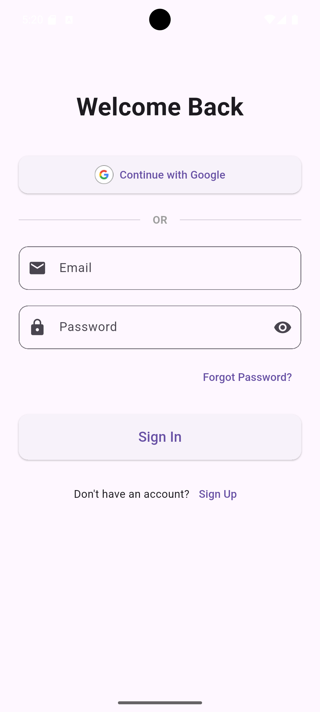
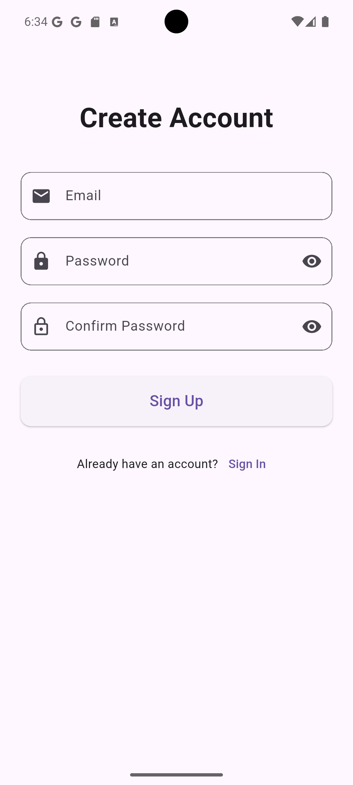
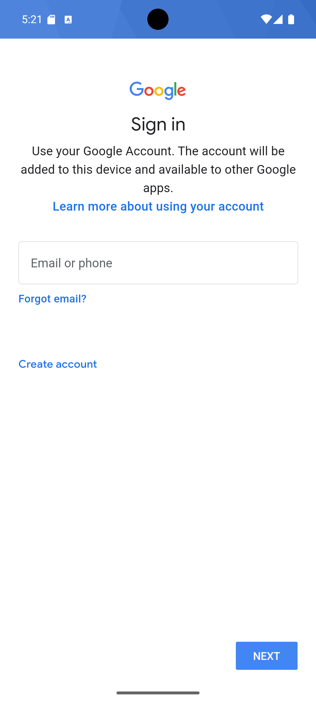

# Todo App

A modern and feature-rich Todo application built with Flutter, featuring authentication, task management, and a beautiful user interface.

## Features

- 🔐 **Authentication**

  - Email/Password authentication
  - Google Sign-In integration
  - Secure user sessions

- ✅ **Task Management**

  - Create, read, update, and delete tasks
  - Set due dates for tasks
  - Add detailed descriptions
  - Mark tasks as complete

- 📊 **Task Organization**

  - Filter tasks by status (Pending, Finished, Overdue)
  - Automatic overdue task detection
  - Visual status indicators
  - Color-coded task states

- 🎨 **User Interface**
  - Modern and clean design
  - Intuitive navigation
  - Responsive layout
  - Loading indicators and feedback
  - Form validation

## Screenshots

### Authentication & Task Management

<div align="center">
  
  
  
  
  
</div>

## Getting Started

### Prerequisites

- Flutter SDK (latest version)
- Dart SDK (latest version)
- Android Studio / VS Code
- Firebase project (for authentication)

### Installation

1. Clone the repository:

```bash
git clone https://github.com/omarahmeddsa/todoapp.git
```

2. Navigate to the project directory:

```bash
cd todoapp
```

3. Install dependencies:

```bash
flutter pub get
```

4. Configure Firebase:

   - Create a new Firebase project
   - Add Android/iOS apps to your Firebase project
   - Download and add the configuration files
   - Enable Email/Password and Google Sign-In in Firebase Console

5. Run the app:

```bash
flutter run
```

## Project Structure

```
lib/
├── app/
│   ├── Homepage.dart
│   ├── SignIn.dart
│   ├── SignUp.dart
│   └── TaskForm.dart
├── provider/
│   ├── Auth_provider.dart
│   └── DataBase.dart
└── main.dart
```

## Dependencies

- `provider`: State management
- `firebase_auth`: Firebase authentication
- `google_sign_in`: Google Sign-In integration
- `intl`: Date formatting and localization
- `sqflite`: Local database storage

## Contributing

1. Fork the repository
2. Create your feature branch (`git checkout -b feature/AmazingFeature`)
3. Commit your changes (`git commit -m 'Add some AmazingFeature'`)
4. Push to the branch (`git push origin feature/AmazingFeature`)
5. Open a Pull Request

## License

This project is licensed under the MIT License - see the [LICENSE](LICENSE) file for details.

## Acknowledgments

- Flutter team for the amazing framework
- Firebase for authentication services
- All contributors who have helped with the project

## Contact

Omar Hassan - [@Omar Hassan](https://github.com/omarahmeddsa)

LinkedIn - [Omar Ahmed](https://www.linkedin.com/in/omar-ahmed-a769b9203)

Project Link: [https://github.com/omarahmeddsa/todoapp](https://github.com/omarahmeddsa/todoapp)
