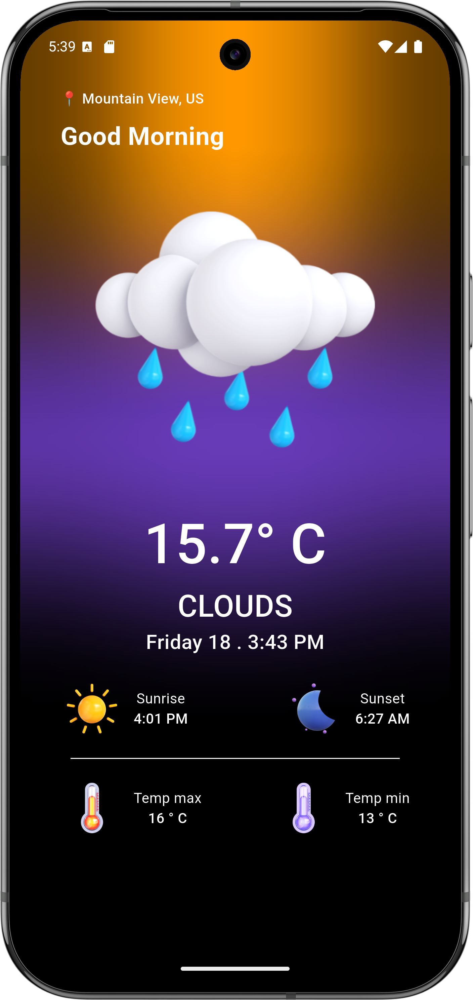

# Weather BLoC Flutter App

A modern and intuitive weather application built with Flutter and the BLoC pattern. This app provides real-time weather updates based on your current location, featuring a beautiful and responsive UI.

## Features

- 🌦️ **Current Weather**: Get real-time weather information for your current location
- 📍 **Location-based Forecast**: Automatically fetches weather using device location
- 🎨 **Modern UI**: Clean, animated, and visually appealing interface
- 🌙 **Dark Theme**: Eye-friendly dark mode design
- 🔄 **State Management**: Efficient state management using BLoC pattern
- 🌡️ **Detailed Metrics**: Temperature, weather type, sunrise, sunset, min/max temperature
- 🖼️ **Custom Weather Icons**: Beautiful weather icons for different conditions

## Screenshots

<div align="center">
  <table>
    <tr>
      <td align="center">
        <h3>Home Screen</h3>
        
        <p><em>Main dashboard showing current weather and details</em></p>
      </td>
    </tr>
  </table>
</div>

## Getting Started

### Prerequisites

- Flutter SDK (latest version)
- Dart SDK (latest version)
- Android Studio / VS Code
- Android SDK / Xcode (for iOS development)

### Installation

1. Clone the repository:

```bash
git clone https://github.com/yourusername/weather_bloc_flutter.git
```

2. Navigate to the project directory:

```bash
cd weather_bloc_flutter
```

3. Install dependencies:

```bash
flutter pub get
```

4. Run the app:

```bash
flutter run
```

## Dependencies

- `flutter_bloc`: ^9.1.1 - State management
- `equatable`: ^2.0.7 - Value equality for Dart objects
- `http`: ^1.4.0 - HTTP requests
- `geolocator`: ^14.0.2 - Location services
- `weather`: ^3.2.1 - Weather API integration
- `intl`: ^0.20.2 - Internationalization and formatting
- `flutter_spinkit`: ^5.2.1 - Loading indicators
- `cupertino_icons`: ^1.0.8 - iOS style icons

## Project Structure

```
lib/
├── bloc/
│   ├── weather_bloc.dart
│   ├── weather_event.dart
│   └── weather_state.dart
├── models/
├── screens/
│   └── homescreen.dart
├── service/
│   └── locationrepo.dart
├── assets/
│   └── [weather icons/images]
├── widgets/
└── main.dart
```

## Features in Detail

### Weather Information

- Fetches current weather based on device location
- Displays temperature, weather type, city, country, sunrise, sunset, min/max temperature
- Shows date and time in a user-friendly format
- Custom weather icons for different conditions

### User Interface

- Modern, animated, and responsive design
- Dark theme for comfortable viewing
- Loading indicators for data fetching
- Error handling for location and network issues

## Contributing

1. Fork the repository
2. Create your feature branch (`git checkout -b feature/AmazingFeature`)
3. Commit your changes (`git commit -m 'Add some AmazingFeature'`)
4. Push to the branch (`git push origin feature/AmazingFeature`)
5. Open a Pull Request

## License

This project is licensed under the MIT License - see the [LICENSE](LICENSE) file for details.

## Acknowledgments

- Flutter team for the amazing framework
- BLoC pattern for state management
- All contributors who have helped in the development
